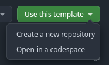
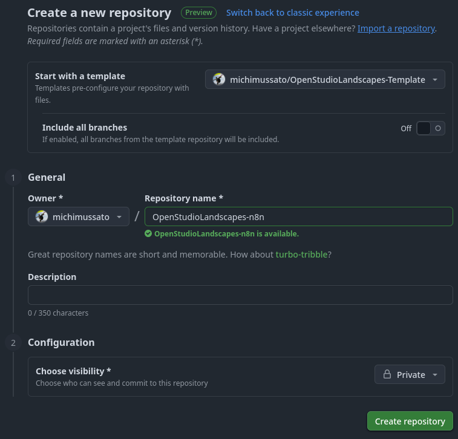

[](https://github.com/michimussato/OpenStudioLandscapes)

***

1. [Feature: OpenStudioLandscapes-Template](#feature-openstudiolandscapes-template)
   1. [Brief](#brief)
   2. [Clone](#clone)
      1. [Clone and Install](#clone-and-install)
      2. [Uninstall](#uninstall)
   3. [Configure](#configure)
      1. [Default Configuration](#default-configuration)
   4. [Local Development/Unit Testing/Debugging](#local-developmentunit-testingdebugging)
2. [Create new Feature from this Template](#create-new-feature-from-this-template)
   1. [Create a new repository from this Template](#create-a-new-repository-from-this-template)
   2. [Clone new Feature to your local drive](#clone-new-feature-to-your-local-drive)
   3. [Replace `Template` occurrences in `OpenStudioLandscapes-NewFeature`](#replace-template-occurrences-in-openstudiolandscapes-newfeature)
   4. [Create `pyproject.toml`](#create-pyprojecttoml)
   5. [Commit your initial Setup](#commit-your-initial-setup)
   6. [Tag `OpenStudioLandscapesUtil` Repos](#tag-openstudiolandscapesutil-repos)
   7. [Enable OpenStudioLandscapes-NewFeature in the Engine](#enable-openstudiolandscapes-newfeature-in-the-engine)
   8. [Known Issues](#known-issues)
      1. [`no command specified`](#no-command-specified)
3. [Community](#community)

***

This `README.md` was dynamically created with [OpenStudioLandscapesUtil-ReadmeGenerator](https://github.com/michimussato/OpenStudioLandscapesUtil-ReadmeGenerator).

***

# Feature: OpenStudioLandscapes-Template

## Brief

This is an extension to the OpenStudioLandscapes ecosystem. The full documentation of OpenStudioLandscapes is available [here](https://github.com/michimussato/OpenStudioLandscapes).

> [!NOTE]
> 
> You feel like writing your own Feature? Go and check out the 
> [OpenStudioLandscapes-Template](https://github.com/michimussato/OpenStudioLandscapes-Template).

## Clone

Clone this repository into `OpenStudioLandscapes/.features` (assuming the current working directory to be the Git repository root `./OpenStudioLandscapes`):

```shell
# cd OpenStudioLandscapes
source .venv/bin/activate
openstudiolandscapes clone-feature --repo=https://github.com/michimussato/OpenStudioLandscapes-Template.git
deactivate
# Check the resulting console output for installation instructions
```

If Feature repository was cloned locally already:

```shell
# cd OpenStudioLandscapes
source .venv/bin/activate
pip install --editable ./.features/<Feature>
deactivate
# Check the resulting console output for installation instructions
```

### Clone and Install

```shell
# cd OpenStudioLandscapes
source .venv/bin/activate
openstudiolandscapes clone-feature --repo=https://github.com/michimussato/OpenStudioLandscapes-Template.git --install
deactivate
```

### Uninstall

```shell
# cd OpenStudioLandscapes
source .venv/bin/activate
pip uninstall OpenStudioLandscapes-Template
deactivate
```

For more info on `pip` see [VCS Support of `pip`](https://pip.pypa.io/en/stable/topics/vcs-support/).

## Configure

OpenStudioLandscapes will search for a local config store. The default location is `~/.config/OpenStudioLandscapes/config-store/` but you can specify a different location if you need to.

> [!TIP]
> 
> To specify a config store location different from
> the default location, check out the OpenStudioLandscapes 
> [CLI Section](https://github.com/michimussato/OpenStudioLandscapes#cli)
> to find out how to do that.

A local config store location will be created if it doesn't exist, together with the `config.yml` files for each individual Feature.

> [!TIP]
> 
> The config store root will be initialized as a local Git
> controlled repository. This makes it easy to track changes
> you made to the `config.yml`.

The following settings are available in `OpenStudioLandscapes-Template` and are based on [`OpenStudioLandscapes-Template/tree/main/src/OpenStudioLandscapes/Template/config/models.py`](https://github.com/michimussato/OpenStudioLandscapes-Template/tree/main/src/OpenStudioLandscapes/Template/config/models.py).

### Default Configuration

<details open>
<summary><code>config.yml</code></summary>


```yaml
ENV_VAR_PORT_CONTAINER:
  default: 2345
  description: The Ayon container port.
  exclusiveMinimum: 0
  title: Env Var Port Container
  type: integer
ENV_VAR_PORT_HOST:
  default: 1234
  description: The host port.
  exclusiveMinimum: 0
  title: Env Var Port Host
  type: integer
MOUNTED_VOLUME:
  default: '{DOT_LANDSCAPES}/{LANDSCAPE}/{FEATURE}/volume'
  description: The host side mounted volume.
  format: path
  title: Mounted Volume
  type: string
compose_scope:
  default: default
  examples:
  - default
  - license_server
  - worker
  title: Compose Scope
  type: string
docker_compose:
  default: '{DOT_LANDSCAPES}/{LANDSCAPE}/{FEATURE}/docker_compose/docker-compose.yml'
  description: The path to the `docker-compose.yml` file.
  format: path
  title: Docker Compose
  type: string
enabled:
  default: false
  title: Enabled
  type: boolean
env:
  additionalProperties: true
  title: Env
  type: object
feature_name:
  default: OpenStudioLandscapes-Template
  title: Feature Name
  type: string
group_name:
  default: OpenStudioLandscapes_Template
  title: Group Name
  type: string
key_prefixes:
  default:
  - OpenStudioLandscapes_Template
  items:
    type: string
  title: Key Prefixes
  type: array
local_bind_volumes:
  description: Here you can define Feature specific, arbitrary, absolute bind volume
    mappings.
  items:
    type: string
  title: Local Bind Volumes
  type: array
local_environment_variables:
  additionalProperties:
    type: string
  description: Here you can define Feature specific, arbitrary environment variables.
  title: Local Environment Variables
  type: object

```

</details>


## Local Development/Unit Testing/Debugging

This is for isolated development, unit testing and debugging. Instead of the [`OpenStudioLandscapes-Template/tree/main/src/OpenStudioLandscapes/Template/definitions.py`](https://github.com/michimussato/OpenStudioLandscapes-Template/tree/main/src/OpenStudioLandscapes/Template/definitions.py), the accompanying [`OpenStudioLandscapes-Template/tree/main/workspace.yaml`](https://github.com/michimussato/OpenStudioLandscapes-Template/tree/main/workspace.yaml) loads the [`OpenStudioLandscapes-Template/tree/main/src/OpenStudioLandscapes/Template/_definitions_with_upstream_specs.py`](https://github.com/michimussato/OpenStudioLandscapes-Template/tree/main/src/OpenStudioLandscapes/Template/_definitions_with_upstream_specs.py) which also contains [`AssetSpec`](https://release-1-9-13.archive.dagster-docs.io/api/dagster/assets#dagster.AssetSpec) definitions for upstream dependencies as [external assets](https://release-1-9-13.archive.dagster-docs.io/guides/build/assets/external-assets).

```shell
# cd ./.features/OpenStudioLandscapes-Template
python3.11 -m venv .venv
source .venv/bin/activate
pip install --upgrade pip setuptools setuptools_scm wheel
pip install --editable .[dev]
dagster dev --workspace workspace.yaml
```

***

# Create new Feature from this Template

[](https://www.url.com)

## Create a new repository from this Template

Click `Use this template` and select `Create a new repository`



And fill in information as needed by specifying the `Repository name *` of the OpenStudioLandscapes Feature (i.e. `OpenStudioLandscapes-NewFeature`):



## Clone new Feature to your local drive

Clone the new Feature into the `.features` directory of your local `OpenStudioLandscapes` clone:

```generic
cd /to/your/git/repos/OpenStudioLandscapes/.features
git clone <GIT_REPOSITORY_URL>
```

## Replace `Template` occurrences in `OpenStudioLandscapes-NewFeature`

Rename the package directory from `Template` to `NewFeature`:

```generic
NEW_FEATURE="NewFeature"

cd /to/your/git/repos/OpenStudioLandscapes/.features/OpenStudioLandscapes-${NEW_FEATURE}
mv src/OpenStudioLandscapes/Template src/OpenStudioLandscapes/${NEW_FEATURE}
```

Rename all occurrences of `template` in your new Feature with the correct name in the following files:

- update [`./pyproject.toml`](./pyproject.toml)
- update `./pyproject_layer.yaml`
- update `./src/OpenStudioLandscapes/${NEW_FEATURE}/__init__.py`
- update `./src/OpenStudioLandscapes/${NEW_FEATURE}/assets.py`
- update `./src/OpenStudioLandscapes/${NEW_FEATURE}/constants.py`
- update `./src/OpenStudioLandscapes/${NEW_FEATURE}/definitions.py`
- update `./src/OpenStudioLandscapes/${NEW_FEATURE}/readme_feature.py` [`snakemd` Documentation](https://www.snakemd.io/en/latest/)
- update `/.coveragerc`
- remove media `rm ./media/images/*.*`
- remove nox reports `rm ./.nox/*.*`
- remove sbom reports `rm ./.sbom/*.*`

## Create `pyproject.toml`

```generic
nox -session "readme(OpenStudioLandscapes-<FEATURE>)"
```

## Commit your initial Setup

Commit all changes to Git:

```generic
git add *
git commit -m "Initial Setup"
git push
```

## Tag `OpenStudioLandscapesUtil` Repos

- [OpenStudioLandscapesUtil-HarborCLI](https://github.com/michimussato/OpenStudioLandscapesUtil-HarborCLI?tab=readme-ov-file#tagging)
- [OpenStudioLandscapesUtil-ReadmeGenerator](https://github.com/michimussato/OpenStudioLandscapesUtil-ReadmeGenerator?tab=readme-ov-file#tagging)

## Enable OpenStudioLandscapes-NewFeature in the Engine

Commit all changes to Git:

```generic
cd /to/your/git/repos/OpenStudioLandscapes
source .venv/bin/activate
pip install --editable .features/OpenStudioLandscapes-${NEW_FEATURE}[dev]
pip install --editable .[dev]
```

Edit the `OpenStudioLandscapes.engine` to use your new Feature:

- update `OpenStudioLandscapes/.env`
- update `OpenStudioLandscapes/src/OpenStudioLandscapes/engine/features.py`
- update `OpenStudioLandscapes/README.md#current-feature-statuses`

## Known Issues

### `no command specified`

`OpenStudioLandscapes-Template` can't be launched as a Feature in a Landscape. If you do, this is the error message you will be presented with:

```shell
$ /home/michael/git/repos/OpenStudioLandscapes/.landscapes/2025-10-20-12-51-39-68351d36801042cb943f1675e611e3c0/ComposeScope_default__ComposeScope_default/ComposeScope_default__DOCKER_COMPOSE/docker_compose/docker_compose_up.sh
~/git/repos/OpenStudioLandscapes/.landscapes/2025-10-20-12-51-39-68351d36801042cb943f1675e611e3c0/ComposeScope_default__ComposeScope_default/ComposeScope_default__DOCKER_COMPOSE/docker_compose ~
Working Directory: /home/michael/git/repos/OpenStudioLandscapes/.landscapes/2025-10-20-12-51-39-68351d36801042cb943f1675e611e3c0/ComposeScope_default__ComposeScope_default/ComposeScope_default__DOCKER_COMPOSE/docker_compose
Sourcing ../../../../2025-10-20-12-51-39-68351d36801042cb943f1675e611e3c0/.overrides file...
Sourced successfully.
 Container hbbs--2025-10-20-12-51-39-68351d36801042cb943f1675e611e3c0  Creating
 Container dagster--2025-10-20-12-51-39-68351d36801042cb943f1675e611e3c0  Creating
 Container template--2025-10-20-12-51-39-68351d36801042cb943f1675e611e3c0  Creating
 Container mongo-express-10-2--2025-10-20-12-51-39-68351d36801042cb943f1675e611e3c0  Creating
 Container repository-installer-10-2--2025-10-20-12-51-39-68351d36801042cb943f1675e611e3c0  Creating
 Container ayon-server--2025-10-20-12-51-39-68351d36801042cb943f1675e611e3c0  Creating
 Container opencue-flyway--2025-10-20-12-51-39-68351d36801042cb943f1675e611e3c0  Creating
 Container kitsu--2025-10-20-12-51-39-68351d36801042cb943f1675e611e3c0  Creating
 Container template--2025-10-20-12-51-39-68351d36801042cb943f1675e611e3c0  Error response from daemon: no command specified
Error response from daemon: no command specified
~
```

***

# Community

| Feature                                   | GitHub                                                                                                                                                 | Discord                                                                      |
| ----------------------------------------- | ------------------------------------------------------------------------------------------------------------------------------------------------------ | ---------------------------------------------------------------------------- |
| OpenStudioLandscapes                      | [https://github.com/michimussato/OpenStudioLandscapes](https://github.com/michimussato/OpenStudioLandscapes)                                           | [# openstudiolandscapes-general](https://discord.gg/F6bDRWsHac)              |
| OpenStudioLandscapes-Ayon                 | [https://github.com/michimussato/OpenStudioLandscapes-Ayon](https://github.com/michimussato/OpenStudioLandscapes-Ayon)                                 | [# openstudiolandscapes-ayon](https://discord.gg/gd6etWAF3v)                 |
| OpenStudioLandscapes-Dagster              | [https://github.com/michimussato/OpenStudioLandscapes-Dagster](https://github.com/michimussato/OpenStudioLandscapes-Dagster)                           | [# openstudiolandscapes-dagster](https://discord.gg/jwB3DwmKvs)              |
| OpenStudioLandscapes-Deadline-10-2        | [https://github.com/michimussato/OpenStudioLandscapes-Deadline-10-2](https://github.com/michimussato/OpenStudioLandscapes-Deadline-10-2)               | [# openstudiolandscapes-deadline-10-2](https://discord.gg/p2UjxHk4Y3)        |
| OpenStudioLandscapes-Deadline-10-2-Worker | [https://github.com/michimussato/OpenStudioLandscapes-Deadline-10-2-Worker](https://github.com/michimussato/OpenStudioLandscapes-Deadline-10-2-Worker) | [# openstudiolandscapes-deadline-10-2-worker](https://discord.gg/ttkbfkzUmf) |
| OpenStudioLandscapes-Flamenco             | [https://github.com/michimussato/OpenStudioLandscapes-Flamenco](https://github.com/michimussato/OpenStudioLandscapes-Flamenco)                         | [# openstudiolandscapes-flamenco](https://discord.gg/EPrX5fzBCf)             |
| OpenStudioLandscapes-Flamenco-Worker      | [https://github.com/michimussato/OpenStudioLandscapes-Flamenco-Worker](https://github.com/michimussato/OpenStudioLandscapes-Flamenco-Worker)           | [# openstudiolandscapes-flamenco-worker](https://discord.gg/Sa2zFqSc4p)      |
| OpenStudioLandscapes-Grafana              | [https://github.com/michimussato/OpenStudioLandscapes-Grafana](https://github.com/michimussato/OpenStudioLandscapes-Grafana)                           | [# openstudiolandscapes-grafana](https://discord.gg/gEDQ8vJWDb)              |
| OpenStudioLandscapes-Kitsu                | [https://github.com/michimussato/OpenStudioLandscapes-Kitsu](https://github.com/michimussato/OpenStudioLandscapes-Kitsu)                               | [# openstudiolandscapes-kitsu](https://discord.gg/6cc6mkReJ7)                |
| OpenStudioLandscapes-LikeC4               | [https://github.com/michimussato/OpenStudioLandscapes-LikeC4](https://github.com/michimussato/OpenStudioLandscapes-LikeC4)                             | [# openstudiolandscapes-likec4](https://discord.gg/qAYYsKYF6V)               |
| OpenStudioLandscapes-OpenCue              | [https://github.com/michimussato/OpenStudioLandscapes-OpenCue](https://github.com/michimussato/OpenStudioLandscapes-OpenCue)                           | [# openstudiolandscapes-opencue](https://discord.gg/3DdCZKkVyZ)              |
| OpenStudioLandscapes-OpenCue-Worker       | [https://github.com/michimussato/OpenStudioLandscapes-OpenCue-Worker](https://github.com/michimussato/OpenStudioLandscapes-OpenCue-Worker)             | [# openstudiolandscapes-opencue-worker](https://discord.gg/n9fxxhHa3V)       |
| OpenStudioLandscapes-RustDeskServer       | [https://github.com/michimussato/OpenStudioLandscapes-RustDeskServer](https://github.com/michimussato/OpenStudioLandscapes-RustDeskServer)             | [# openstudiolandscapes-rustdeskserver](https://discord.gg/nJ8Ffd2xY3)       |
| OpenStudioLandscapes-Syncthing            | [https://github.com/michimussato/OpenStudioLandscapes-Syncthing](https://github.com/michimussato/OpenStudioLandscapes-Syncthing)                       | [# openstudiolandscapes-syncthing](https://discord.gg/upb9MCqb3X)            |
| OpenStudioLandscapes-Template             | [https://github.com/michimussato/OpenStudioLandscapes-Template](https://github.com/michimussato/OpenStudioLandscapes-Template)                         | [# openstudiolandscapes-template](https://discord.gg/J59GYp3Wpy)             |
| OpenStudioLandscapes-VERT                 | [https://github.com/michimussato/OpenStudioLandscapes-VERT](https://github.com/michimussato/OpenStudioLandscapes-VERT)                                 | [# openstudiolandscapes-vert](https://discord.gg/EPrX5fzBCf)                 |
| OpenStudioLandscapes-filebrowser          | [https://github.com/michimussato/OpenStudioLandscapes-filebrowser](https://github.com/michimussato/OpenStudioLandscapes-filebrowser)                   | [# openstudiolandscapes-filebrowser](https://discord.gg/stzNsZBmwk)          |
| OpenStudioLandscapes-n8n                  | [https://github.com/michimussato/OpenStudioLandscapes-n8n](https://github.com/michimussato/OpenStudioLandscapes-n8n)                                   | [# openstudiolandscapes-n8n](https://discord.gg/yFYrG999wE)                  |

To follow up on the previous LinkedIn publications, visit:

- [OpenStudioLandscapes on LinkedIn](https://www.linkedin.com/company/106731439/).
- [Search for tag #OpenStudioLandscapes on LinkedIn](https://www.linkedin.com/search/results/all/?keywords=%23openstudiolandscapes).

***

Last changed: **2026-07-20 11:19:17 UTC**