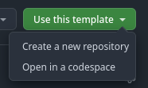
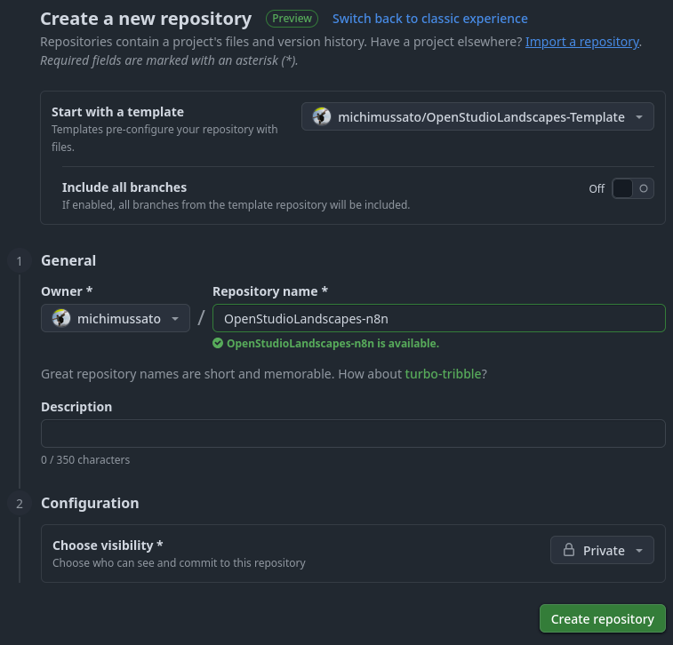

[](https://github.com/michimussato/OpenStudioLandscapes)

---

<!-- TOC -->
* [OpenStudioLandscapes Feature Template](#openstudiolandscapes-feature-template)
  * [Guide: How to use the Feature Template](#guide-how-to-use-the-feature-template)
  * [Refactor](#refactor)
    * [Diffs](#diffs)
      * [`src/OpenStudioLandscapes/n8n/__init__.py`](#srcopenstudiolandscapesn8n__init__py)
      * [`src/OpenStudioLandscapes/n8n/assets.py`](#srcopenstudiolandscapesn8nassetspy)
      * [`src/OpenStudioLandscapes/n8n/constants.py`](#srcopenstudiolandscapesn8nconstantspy)
      * [`src/OpenStudioLandscapes/n8n/definitions.py`](#srcopenstudiolandscapesn8ndefinitionspy)
      * [`src/OpenStudioLandscapes/n8n/pyproject.py`](#srcopenstudiolandscapesn8npyprojectpy)
      * [`src/OpenStudioLandscapes/n8n/README.md`](#srcopenstudiolandscapesn8nreadmemd)
      * [`src/OpenStudioLandscapes/n8n/readme_feature.py`](#srcopenstudiolandscapesn8nreadme_featurepy)
      * [`src/OpenStudioLandscapes/n8n/setup.cfg`](#srcopenstudiolandscapesn8nsetupcfg)
      * [`src/OpenStudioLandscapes/n8n/setup.py`](#srcopenstudiolandscapesn8nsetuppy)
  * [First Install](#first-install)
    * [Add Feature to OpenStudioLandscapes](#add-feature-to-openstudiolandscapes)
* [File De-Duplication (Hard-Links)](#file-de-duplication-hard-links)
<!-- TOC -->

---

# OpenStudioLandscapes Feature Template

## Guide: How to use the Feature Template

Go to [GitHub](https://github.com/michimussato/OpenStudioLandscapes-Template)
and select `Use this template` -> `Create a new repository`:



From there, set up your new repository as desired:



## Refactor

Refactor the new repository that was derived from `OpenStudioLandscapes-Template`.

Rename the package directory:

```
renamed:    src/OpenStudioLandscapes/Template/__init__.py -> src/OpenStudioLandscapes/n8n/__init__.py
renamed:    src/OpenStudioLandscapes/Template/assets.py -> src/OpenStudioLandscapes/n8n/assets.py
renamed:    src/OpenStudioLandscapes/Template/constants.py -> src/OpenStudioLandscapes/n8n/constants.py
renamed:    src/OpenStudioLandscapes/Template/definitions.py -> src/OpenStudioLandscapes/n8n/definitions.py
renamed:    src/OpenStudioLandscapes/Template/readme_feature.py -> src/OpenStudioLandscapes/n8n/readme_feature.py
```

### Diffs

Replace all occurrences of `template` with the name of your new Feature.

#### `src/OpenStudioLandscapes/n8n/__init__.py`

```
Index: src/OpenStudioLandscapes/Template/__init__.py
IDEA additional info:
Subsystem: com.intellij.openapi.diff.impl.patch.CharsetEP
<+>UTF-8
===================================================================
diff --git a/src/OpenStudioLandscapes/Template/__init__.py b/src/OpenStudioLandscapes/n8n/__init__.py
rename from src/OpenStudioLandscapes/Template/__init__.py
rename to src/OpenStudioLandscapes/n8n/__init__.py
--- a/src/OpenStudioLandscapes/Template/__init__.py	(revision 80072c410427807fc6e136ad6b129b1d658f71ea)
+++ b/src/OpenStudioLandscapes/n8n/__init__.py	(date 1755438994663)
@@ -8,7 +8,7 @@
 
 try:
     # Change here if project is renamed and does not equal the package name
-    dist_name = "OpenStudioLandscapes-Template"
+    dist_name = "OpenStudioLandscapes-n8n"
     __version__ = version(dist_name)
 except PackageNotFoundError:  # pragma: no cover
     __version__ = "unknown"
```

#### `src/OpenStudioLandscapes/n8n/assets.py`

```
Index: src/OpenStudioLandscapes/Template/assets.py
IDEA additional info:
Subsystem: com.intellij.openapi.diff.impl.patch.CharsetEP
<+>UTF-8
===================================================================
diff --git a/src/OpenStudioLandscapes/Template/assets.py b/src/OpenStudioLandscapes/n8n/assets.py
rename from src/OpenStudioLandscapes/Template/assets.py
rename to src/OpenStudioLandscapes/n8n/assets.py
--- a/src/OpenStudioLandscapes/Template/assets.py	(revision 80072c410427807fc6e136ad6b129b1d658f71ea)
+++ b/src/OpenStudioLandscapes/n8n/assets.py	(date 1755438936819)
@@ -1,8 +1,6 @@
 import copy
 import json
 import pathlib
-import re
-import shutil
 import textwrap
 import time
 import urllib.parse
@@ -24,7 +22,7 @@
 from OpenStudioLandscapes.engine.utils import *
 from OpenStudioLandscapes.engine.utils.docker import *
 
-from OpenStudioLandscapes.Template.constants import *
+from OpenStudioLandscapes.n8n.constants import *
 
 from OpenStudioLandscapes.engine.common_assets.constants import get_constants
 from OpenStudioLandscapes.engine.common_assets.docker_config import get_docker_config
@@ -263,8 +261,8 @@
     if compose_network_mode == ComposeNetworkMode.DEFAULT:
         docker_dict = {
             "networks": {
-                "template": {
-                    "name": "network_template",
+                "n8n": {
+                    "name": "network_n8n",
                 },
             },
         }
@@ -305,7 +303,7 @@
         ),
     },
 )
-def compose_template(
+def compose_n8n(
     context: AssetExecutionContext,
     build: dict,  # pylint: disable=redefined-outer-name
     env: dict,  # pylint: disable=redefined-outer-name
@@ -357,7 +355,7 @@
 
     command = []
 
-    service_name = "Template"
+    service_name = "n8n"
     container_name = "--".join([service_name, env.get("LANDSCAPE", "default")])
     host_name = ".".join([service_name, env["ROOT_DOMAIN"]])
 
@@ -399,8 +397,8 @@
 @asset(
     **ASSET_HEADER,
     ins={
-        "compose_template": AssetIn(
-            AssetKey([*ASSET_HEADER["key_prefix"], "compose_template"]),
+        "compose_n8n": AssetIn(
+            AssetKey([*ASSET_HEADER["key_prefix"], "compose_n8n"]),
         ),
     },
 )
```

#### `src/OpenStudioLandscapes/n8n/constants.py`

```
Index: src/OpenStudioLandscapes/Template/constants.py
IDEA additional info:
Subsystem: com.intellij.openapi.diff.impl.patch.CharsetEP
<+>UTF-8
===================================================================
diff --git a/src/OpenStudioLandscapes/Template/constants.py b/src/OpenStudioLandscapes/n8n/constants.py
rename from src/OpenStudioLandscapes/Template/constants.py
rename to src/OpenStudioLandscapes/n8n/constants.py
--- a/src/OpenStudioLandscapes/Template/constants.py	(revision 80072c410427807fc6e136ad6b129b1d658f71ea)
+++ b/src/OpenStudioLandscapes/n8n/constants.py	(date 1755438936825)
@@ -25,7 +25,7 @@
 DOCKER_USE_CACHE = DOCKER_USE_CACHE_GLOBAL or False
 
 
-GROUP = "Template"
+GROUP = "n8n"
 KEY = [GROUP]
 FEATURE = f"OpenStudioLandscapes-{GROUP}".replace("_", "-")
```

#### `src/OpenStudioLandscapes/n8n/definitions.py`

```
Index: src/OpenStudioLandscapes/Template/definitions.py
IDEA additional info:
Subsystem: com.intellij.openapi.diff.impl.patch.CharsetEP
<+>UTF-8
===================================================================
diff --git a/src/OpenStudioLandscapes/Template/definitions.py b/src/OpenStudioLandscapes/n8n/definitions.py
rename from src/OpenStudioLandscapes/Template/definitions.py
rename to src/OpenStudioLandscapes/n8n/definitions.py
--- a/src/OpenStudioLandscapes/Template/definitions.py	(revision 80072c410427807fc6e136ad6b129b1d658f71ea)
+++ b/src/OpenStudioLandscapes/n8n/definitions.py	(date 1755438936814)
@@ -3,15 +3,15 @@
     load_assets_from_modules,
 )
 
-import OpenStudioLandscapes.Template.assets
-import OpenStudioLandscapes.Template.constants
+import OpenStudioLandscapes.n8n.assets
+import OpenStudioLandscapes.n8n.constants
 
 assets = load_assets_from_modules(
-    modules=[OpenStudioLandscapes.Template.assets],
+    modules=[OpenStudioLandscapes.n8n.assets],
 )
 
 constants = load_assets_from_modules(
-    modules=[OpenStudioLandscapes.Template.constants],
+    modules=[OpenStudioLandscapes.n8n.constants],
 )
```

#### `src/OpenStudioLandscapes/n8n/pyproject.py`

```
Index: pyproject.toml
IDEA additional info:
Subsystem: com.intellij.openapi.diff.impl.patch.CharsetEP
<+>UTF-8
===================================================================
diff --git a/pyproject.toml b/pyproject.toml
--- a/pyproject.toml	(revision 80072c410427807fc6e136ad6b129b1d658f71ea)
+++ b/pyproject.toml	(date 1755438473083)
@@ -9,5 +9,5 @@
 version_scheme = "no-guess-dev"
 
 [tool.dagster]
-module_name = "OpenStudioLandscapes.Template.definitions"
-code_location_name = "OpenStudioLandscapes-Template"
+module_name = "OpenStudioLandscapes.n8n.definitions"
+code_location_name = "OpenStudioLandscapes-n8n"
```

#### `src/OpenStudioLandscapes/n8n/readme_feature.py`

```
Index: src/OpenStudioLandscapes/Template/readme_feature.py
IDEA additional info:
Subsystem: com.intellij.openapi.diff.impl.patch.CharsetEP
<+>UTF-8
===================================================================
diff --git a/src/OpenStudioLandscapes/Template/readme_feature.py b/src/OpenStudioLandscapes/n8n/readme_feature.py
rename from src/OpenStudioLandscapes/Template/readme_feature.py
rename to src/OpenStudioLandscapes/n8n/readme_feature.py
--- a/src/OpenStudioLandscapes/Template/readme_feature.py	(revision 80072c410427807fc6e136ad6b129b1d658f71ea)
+++ b/src/OpenStudioLandscapes/n8n/readme_feature.py	(date 1755439173718)
@@ -17,12 +17,12 @@
     #     snakemd.Inline(
     #         text=textwrap.dedent(
     #             """
-    #             Logo Template
+    #             Logo n8n
     #             """
     #         ),
     #         image={
-    #             "Template": "https://www.url.com/yourlogo.png",
-    #         }["Template"],
+    #             "n8n": "https://www.url.com/yourlogo.png",
+    #         }["n8n"],
     #         link="https://www.url.com",
     #     ).__str__()
     # )
@@ -30,7 +30,7 @@
     # doc.add_paragraph(
     #     text=textwrap.dedent(
     #         """
-    #         Official Template information.
+    #         Official n8n information.
     #         """
     #     )
     # )
```

#### `src/OpenStudioLandscapes/n8n/setup.cfg`

```
Index: setup.cfg
IDEA additional info:
Subsystem: com.intellij.openapi.diff.impl.patch.CharsetEP
<+>UTF-8
===================================================================
diff --git a/setup.cfg b/setup.cfg
--- a/setup.cfg	(revision 80072c410427807fc6e136ad6b129b1d658f71ea)
+++ b/setup.cfg	(date 1755438473099)
@@ -4,15 +4,15 @@
 # https://setuptools.pypa.io/en/latest/references/keywords.html
 
 [metadata]
-name = OpenStudioLandscapes-Template
-description = Template Feature for OpenStudioLandscapes
+name = OpenStudioLandscapes-n8n
+description = n8n Feature for OpenStudioLandscapes
 author = Michael Mussato
 author_email = michimussato@gmail.com
 license = AGPL-3.0
 license_files = LICENSE.txt
 long_description = file: README.md
 long_description_content_type = text/markdown; charset=UTF-8
-url = https://github.com/michimussato/OpenStudioLandscapes-Templates
+url = https://github.com/michimussato/OpenStudioLandscapes-n8n
 
 # Change if running only on Windows, Mac or Linux (comma-separated)
 platforms = Linux
@@ -55,7 +55,7 @@
 
 [options.extras_require]
 # Add here additional requirements for extra features, to install with:
-# `pip install OpenStudioLandscapes-Templates[PDF]` like:
+# `pip install OpenStudioLandscapes-n8n[PDF]` like:
 # PDF = ReportLab; RXP
 
 # Add here test requirements (semicolon/line-separated)
@@ -69,7 +69,7 @@
     pipdeptree
 
 sbom =
-    OpenStudioLandscapes-Template[graphviz]
+    OpenStudioLandscapes-n8n[graphviz]
     cyclonedx-bom
 
 lint =
@@ -83,28 +83,28 @@
     pytest
 
 nox =
-    OpenStudioLandscapes-Template[testing]
+    OpenStudioLandscapes-n8n[testing]
     nox
 
 readme =
     OpenStudioLandscapesUtil-ReadmeGenerator @ git+https://github.com/michimussato/OpenStudioLandscapesUtil-ReadmeGenerator.git@v1.0.1
 
 dev =
-    OpenStudioLandscapes-Template[testing]
-    OpenStudioLandscapes-Template[lint]
-    OpenStudioLandscapes-Template[nox]
-    OpenStudioLandscapes-Template[sbom]
-    OpenStudioLandscapes-Template[coverage]
-    OpenStudioLandscapes-Template[readme]
+    OpenStudioLandscapes-n8n[testing]
+    OpenStudioLandscapes-n8n[lint]
+    OpenStudioLandscapes-n8n[nox]
+    OpenStudioLandscapes-n8n[sbom]
+    OpenStudioLandscapes-n8n[coverage]
+    OpenStudioLandscapes-n8n[readme]
     dagster-webserver==1.9.11
 
 [options.entry_points]
 # Add here console scripts like:
 # console_scripts =
-#     script_name = OpenStudioLandscapes.Template.module:function
+#     script_name = OpenStudioLandscapes.n8n.module:function
 # For example:
 # console_scripts =
-#     fibonacci = OpenStudioLandscapes.Template.skeleton:run
+#     fibonacci = OpenStudioLandscapes.n8n.skeleton:run
 # And any other entry points, for example:
 # pyscaffold.cli =
 #     awesome = pyscaffoldext.awesome.extension:AwesomeExtension
@@ -116,7 +116,7 @@
 # CAUTION: --cov flags may prohibit setting breakpoints while debugging.
 #          Comment those flags to avoid this pytest issue.
 addopts =
-    --cov OpenStudioLandscapes.Template --cov-report term-missing
+    --cov OpenStudioLandscapes.n8n --cov-report term-missing
     --verbose
 norecursedirs =
     dist
@@ -152,7 +152,7 @@
 # PyScaffold's parameters when the project was created.
 # This will be used when updating. Do not change!
 version = 4.6
-package = Template
+package = n8n
 extensions =
     namespace
     no_skeleton
```

#### `src/OpenStudioLandscapes/n8n/setup.py`

```
Index: setup.py
IDEA additional info:
Subsystem: com.intellij.openapi.diff.impl.patch.CharsetEP
<+>UTF-8
===================================================================
diff --git a/setup.py b/setup.py
--- a/setup.py	(revision 80072c410427807fc6e136ad6b129b1d658f71ea)
+++ b/setup.py	(date 1755438473104)
@@ -1,5 +1,5 @@
 """
-    Setup file for OpenStudioLandscapes-Template.
+    Setup file for OpenStudioLandscapes-n8n.
     Use setup.cfg to configure your project.
 
     This file was generated with PyScaffold 4.6.
```

## First Install

### Add Feature to OpenStudioLandscapes

Add the following code to `OpenStudioLandscapes.engine.features` (`FEATURES`):

```python
from OpenStudioLandscapes.engine.enums import *
from OpenStudioLandscapes.engine.utils import *


FEATURES: dict[str, dict[str, bool | str | ComposeScope | OpenStudioLandscapesConfig]] = {
    # [...],
    # OpenStudioLandscapes-Template
    "OpenStudioLandscapes-Template": {
        "enabled": False or get_bool_env(
            "OPENSTUDIOLANDSCAPES__ENABLE_FEATURE_OPENSTUDIOLANDSCAPES_TEMPLATE"
        ),
        "module": "OpenStudioLandscapes.Template.definitions",
        "compose_scope": ComposeScope.DEFAULT,
        "feature_config": OpenStudioLandscapesConfig.DEFAULT,
    },
    # [...],
}
```

### Install Feature into OpenStudioLanscapes `venv`

Install `OpenStudioLandscapes-Template` into
`OpenStudioLandscapes/.venv`

```shell
source ../../.venv/bin/activate
pip install -e ".[dev]"
```

## README.md

Basic installation instructions will be generated automatically. 
Once all preliminary steps were executed, the following command will generate
the new `READMD.md` for `Template`:

```shell
nox --session readme
```

# File De-Duplication (Hard-Links)

See [OpenStudioLandscapes README](https://github.com/michimussato/OpenStudioLandscapes#hard-links-sync-files-and-directories-across-repositories-de-duplication)
